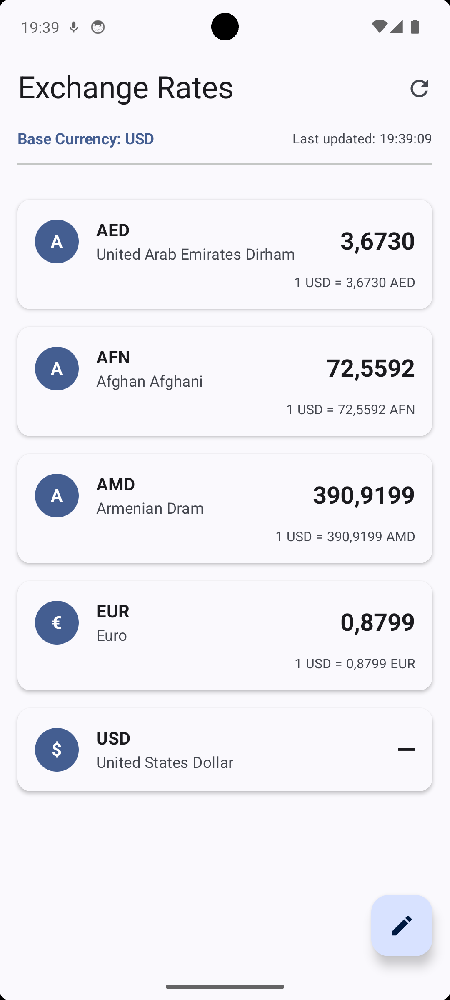
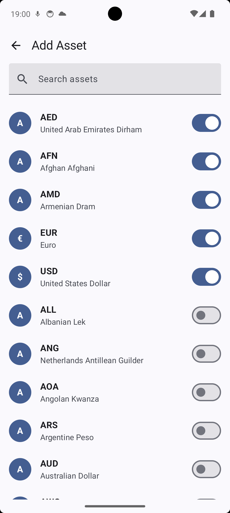

# Currency Dashboard

A modern Android application for tracking currency exchange rates. This app allows users to monitor
the latest exchange rates for various currencies, add or remove currencies from their watchlist, and
view up-to-date information.

## Features

- Track real-time exchange rates for multiple currencies
- Customize your currency watchlist
- Search and filter available currencies
- Clean, modern UI built with Jetpack Compose
- Offline support with local caching

## Screenshots

### Main Screen



The home screen displays the current exchange rates with auto-refresh functionality implemented
using Kotlin Flow:

```kotlin
// Auto-refresh flow implementation in HomeViewModel
private val autoRefreshFlow = flow {
    while (currentCoroutineContext().isActive) {
        emit(Unit)
        delay(refreshInterval)
    }
}.onEach {
    refreshRates()
}.launchIn(viewModelScope)
```

### Add Currency Screen



The add currency screen allows users to search and add new currencies to their watchlist:

```kotlin
// Search implementation with debounce
state
    .map { it.searchQuery }
    .debounce(300)
    .distinctUntilChanged()
    .onEach { query: String ->
        _state.update { it.copy(isLoading = true) }
        loadAssetsWithQuery(query)
    }
    .launchIn(viewModelScope)
```

## API Used

This application uses the [ExchangeRate API](https://exchangerate.host) to fetch currency exchange
rates and available currencies. The API provides:

- Live currency exchange rates
- List of available currencies
- Historical exchange rate data

### API Setup Instructions

1. Register for a free API key at [exchangerate.host](https://exchangerate.host)
2. Copy the `api.properties.sample` file to `api.properties`
3. Replace the placeholder values with your actual API credentials:
   ```
   API_KEY=your_api_key_here
   BASE_URL=https://api.exchangerate.host/
   ```

Note: The `api.properties` file is excluded from version control to keep API credentials secure.

## Setup Instructions

### Prerequisites

- Android Studio Giraffe (2023.2.1) or newer
- JDK 11
- Kotlin 1.9 or newer

### Build and Run

1. Clone the repository:
   ```bash
   git clone https://github.com/yourusername/CurrencyDashboard.git
   ```

2. Set up API credentials:
    - Copy `api.properties.sample` to `api.properties`
    - Add your API key from exchangerate.host

3. Open the project in Android Studio

4. Build and run the application on an emulator or physical device

## Architecture

The application follows Clean Architecture principles and MVVM pattern:

- **Data Layer**: Handles data operations with repositories, API services, and local database
- **Domain Layer**: Contains business logic and use cases
- **Presentation Layer**: Manages UI components using Compose and ViewModels

### Tech Stack

- **Kotlin**: Primary programming language
- **Jetpack Compose**: Modern UI toolkit for building native UI
- **Koin**: Dependency injection framework
- **Retrofit**: Type-safe HTTP client for API communication
- **Room**: Persistence library for local database storage
- **Coroutines & Flow**: For asynchronous programming and reactive streams

## Assumptions Made

1. **Base Currency**: USD is used as the default base currency for exchange rates.
2. **Update Frequency**: Exchange rates don't need to be updated more frequently than once per
   manual refresh by the user.
3. **Network Connectivity**: The app handles both online and offline scenarios, providing cached
   data when offline.
4. **Rate Limit**: The free API tier provides not sufficient requests (100) for normal app usage.
5. **Currency Data**: Currency symbols and names provided by the API are accurate and don't need
   validation.
6. **User Preferences**: Users prefer having exchange rates presented in a simple list format for
   easy reading.

## Future Improvements

- Add support for currency conversion calculations
- Implement historical exchange rate charts
- Allow changing the base currency
- Add more detailed currency information
- Implement automatic background refreshing of rates
- Add widgets for quick rate checking

## Acknowledgments

- Exchange rate data provided by [exchangerate.host](https://exchangerate.host)
- Icons and design elements from Material Design 